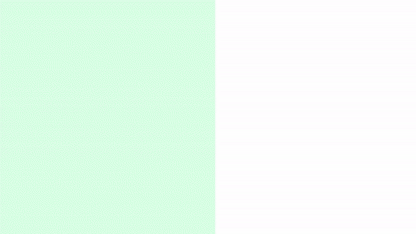
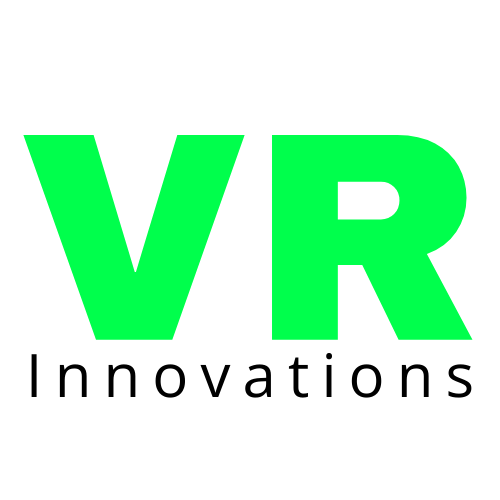
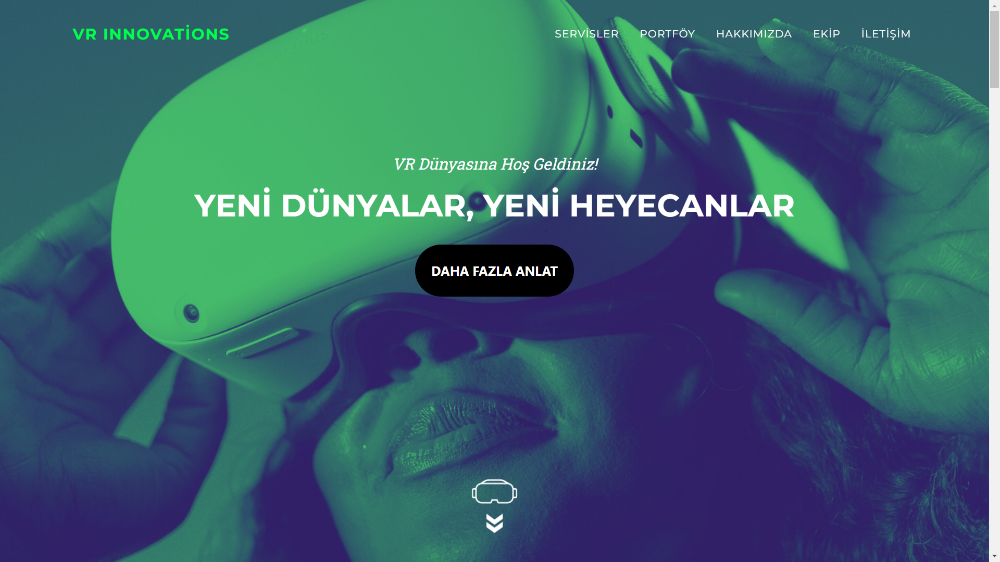
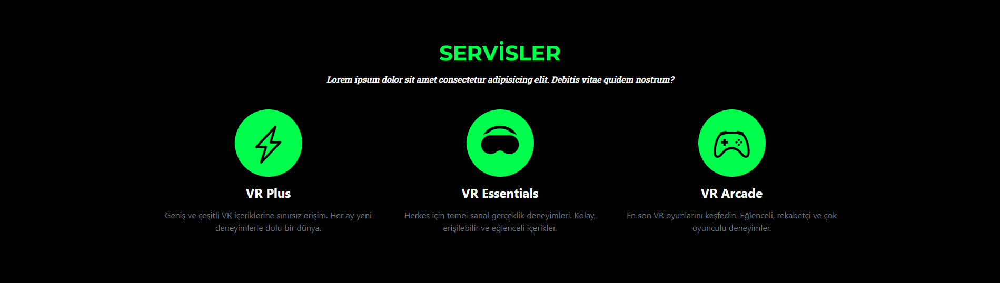
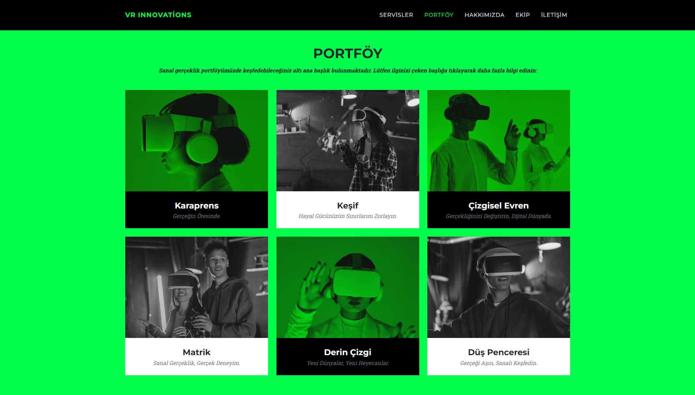
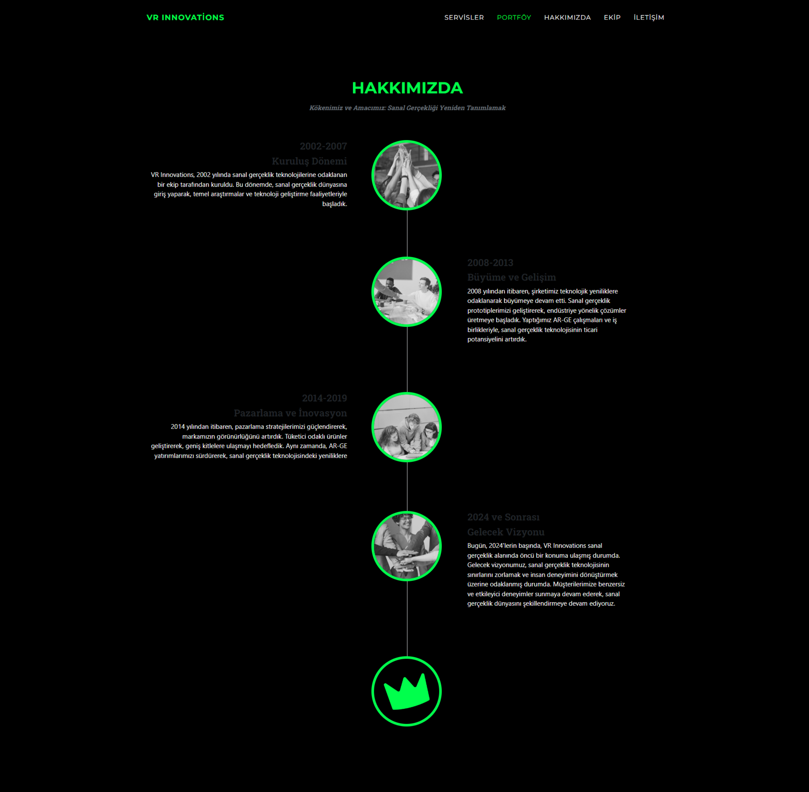
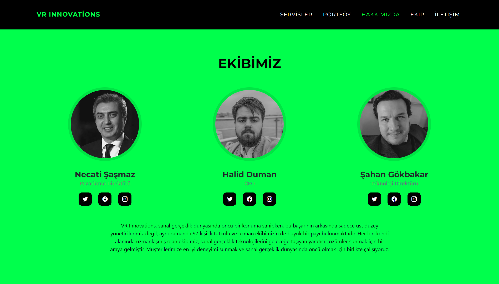
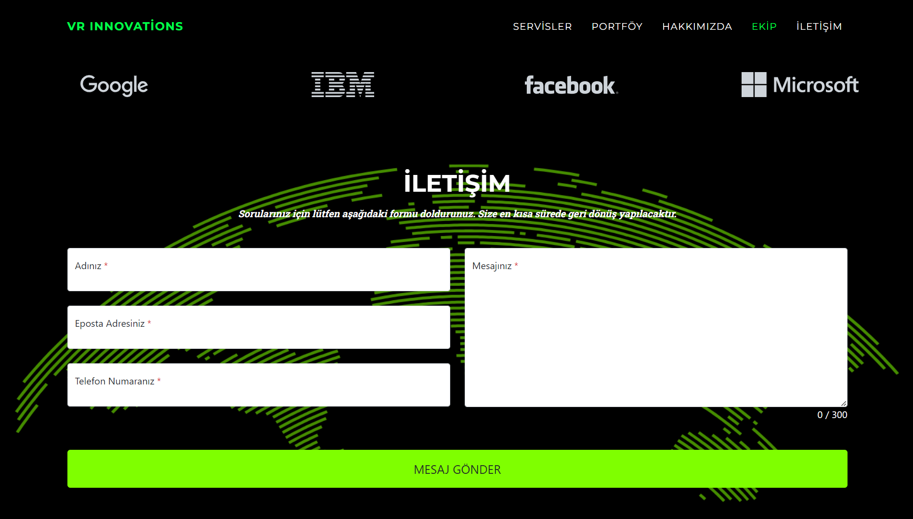

# Sanal Gerçeklik  Şirketi Temalı Web **Sites**

  

  

Bu proje, Sanal Gerçeklik şirketi için basit bir web sitesi oluşturmayı amaçlamaktadır. Bu web sitesi, şirketin hizmetlerini, portföyünü, ekibini, hakkında bilgileri ve iletişim bilgilerini sunmaktadır.

## Proje Açıklaması

Bu web sitesi, HTML, CSS ve JavaScript kullanılarak tek sayfadan oluşturulmuştur. Renk teması siyah ve yeşil olarak belirlenmiştir. Web sitesinde beş ana bölüm bulunmaktadır:

1. **Servisler:** Şirketin sunduğu hizmetler hakkında bilgileri içeren bölüm.

2. **Portföy:** Şirketin sunduğu hizmetler ve projelerin yer aldığı portföy bölümü.
   
3. **Hakkımızda:** Şirket hakkında tarihsel bilgiler ve ekibin tanıtıldığı bölüm.
   
4. **Ekip:** Şirketin çalışanları ve ekibin **tanıtıldığı** bölüm.
   
5. **İletişim:** Müşterilerin şirketle iletişime geçebileceği bilgilerin bulunduğu bölüm.
   
6. **Footer:** 
   

## Kullanılan Teknolojiler

Bu web sitesi aşağıdaki teknolojiler kullanılarak oluşturulmuştur:

- HTML
- CSS
- JavaScript

